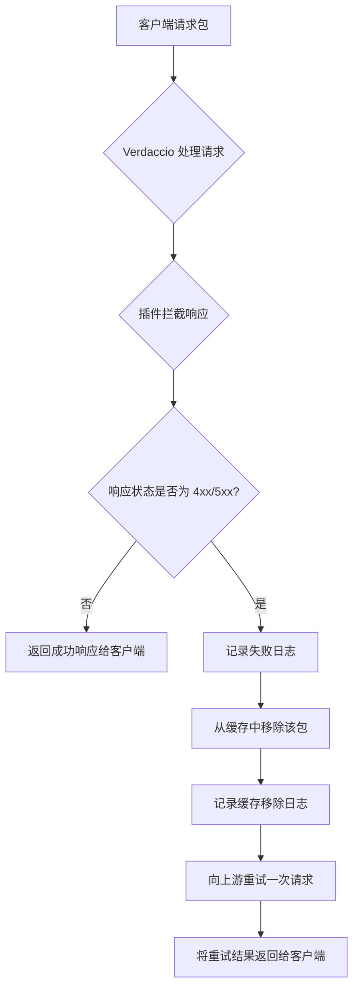

# verdaccio-retry

verdaccio-retry 是一个 Verdaccio 的中间件插件，用于在包下载失败时自动清理缓存并重试下载，提高私有 npm 仓库的稳定性。

## 插件简介

当你通过 Verdaccio 下载 npm 包的 tarball（`.tgz` 文件）时，如果遇到 HTTP 4xx 或 5xx 错误，verdaccio-retry 插件会自动拦截该失败请求，并将对应的包从 Verdaccio 的本地缓存中移除。

**插件会在清理缓存后自动重试一次请求，如果重试成功，用户第一次请求即可获得正确的包，无需手动重试。只有重试后依然失败时才会返回错误。**

### 逻辑流程图



## 安装方法

确保你的环境已经安装了 Verdaccio。

```bash
npm install verdaccio-retry
```

## 配置方法

在 Verdaccio 的 `config.yaml` 文件中，添加如下配置以启用插件：

```yaml
middlewares:
  verdaccio-retry:
    enabled: true
```

配置完成后，重启 Verdaccio 服务即可。

## 使用说明

插件启用后会自动在后台运行，无需手动操作。

**当包下载失败（如 4xx/5xx 错误）时，插件会自动清理缓存并立即重试一次请求，最大程度保证用户体验。**

你可以通过查看 Verdaccio 的服务日志来观察插件的工作情况。当包下载失败并被插件成功移除缓存时，日志中会出现类似如下内容：

```log
warn --- [verdaccio-retry] non-200 response for package 'xlsx', triggering cache removal and retry.
info --- [verdaccio-retry] successfully removed cached package 'xlsx'. Retrying request.
```

## 开发与构建

如需参与开发，请参考 [verdaccio 官方贡献指南](https://github.com/verdaccio/verdaccio/blob/master/CONTRIBUTING.md)。

常用 npm 脚本命令如下：

- `npm run build`  
  构建可分发的插件包

- `npm run test`  
  运行单元测试

如需了解更多命令用法，可执行：

```bash
npm run <task> -- --help
```

将 `<task>` 替换为具体的任务名（如 build 或 test）。

## Docker 示例

您可以在 `examples` 目录中找到一个 `compose.yml` 文件，用于运行带有此插件的 Verdaccio。

### 目录结构

```
examples
├── compose.yml
└── config
    └── config.yaml
```

### `compose.yml`

```yaml
services:
  verdaccio:
    image: verdaccio/verdaccio
    container_name: 'verdaccio'
    restart: always
    network_mode: host
    user: root
    environment:
      - VERDACCIO_PORT=80
    #ports:
    #  - '4873:4873'
    volumes:
      - './config:/verdaccio/conf'
      - './plugins:/verdaccio/plugins'
```

### 使用方法

1.  **构建并安装插件。** 此步骤会安装依赖、构建插件，并将所需的文件（`package.json` 和编译后的 `lib` 目录）复制到 `plugins` 目录中，以供 Docker 容器使用。
    ```bash
    # 安装依赖
    npm install

    # 构建插件
    npm run build

    # 为插件创建专用目录
    mkdir -p examples/plugins/verdaccio-retry

    # 复制编译后的代码和 package.json
    cp -r lib/ examples/plugins/verdaccio-retry/
    cp package.json examples/plugins/verdaccio-retry/
    ```

2.  **创建用于身份验证的 `htpasswd` 文件。** Verdaccio 被配置为使用此文件来保护发布权限。请将 `your_username` 替换为您想要的用户名，然后根据提示输入密码。
    ```bash
    # 进入 config 目录
    cd examples/config

    # 创建 htpasswd 文件 (需要先安装 apache2-utils 或 httpd-tools)
    htpasswd -c htpasswd your_username
    ```
    创建后，请返回到 `examples` 目录。

3.  **启动 Verdaccio 容器。** 在 `examples` 目录下执行：
    ```bash
    docker-compose up -d
    ```
4.  Verdaccio 将在 80 端口上运行。

---

如需进一步帮助，欢迎提交 issue 或参与社区讨论。